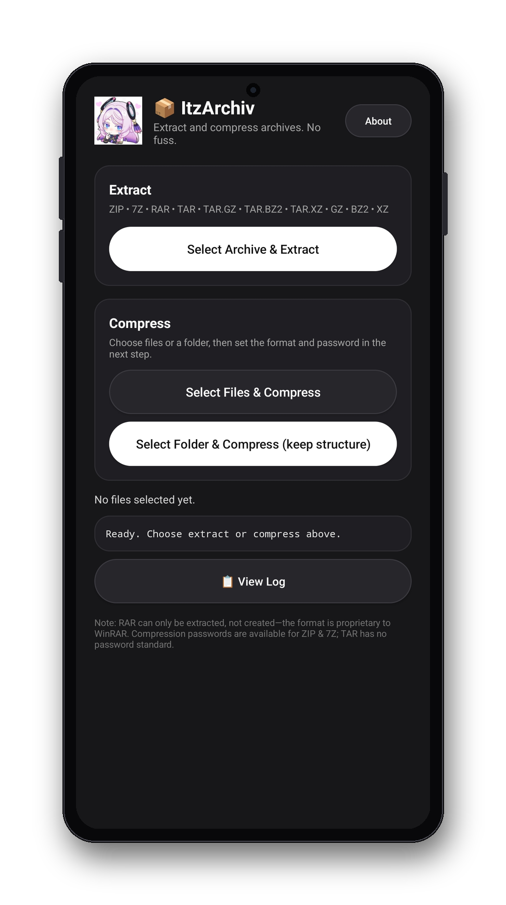

# 📦 ItzArchiv

**Bahasa Indonesia** | [English](README.en.md)

Repository: https://github.com/eLgorythm/ItzArchiv

ItzArchiv adalah aplikasi Android untuk ekstrak dan kompres arsip. Antarmukanya minimalis dan gelap, memakai pemilih file/folder bawaan Android (SAF), dan bahasanya otomatis mengikuti sistem: Bahasa Indonesia atau English.

<p align="center">
  
</p>

## Format yang didukung

**Ekstrak:** ZIP, 7Z, RAR, TAR, TAR.GZ (`.tgz`), TAR.BZ2 (`.tbz2`), TAR.XZ (`.txz`), GZ, BZ2, dan XZ.

**Kompres menjadi:** ZIP, 7Z, TAR, TAR.GZ, TAR.BZ2, dan TAR.XZ.

## Fitur utama

- Ekstrak arsip ke folder pilihan pengguna.
- Kompres banyak file dengan struktur datar berdasarkan nama file.
- Kompres satu folder utuh dengan struktur folder tetap.
- Password kompres untuk ZIP AES-256 dan 7Z; ekstrak arsip berpassword juga didukung.
- Format TAR tidak mendukung password karena tidak ada standar password untuk TAR.
- Opsi menyertakan file/folder tersembunyi saat kompres folder; bawaan mati. File `.trashed-*` selalu dilewati.
- Dialog About muncul sekali per versi saat aplikasi dibuka normal, dapat dibuka lagi dari tombol **Tentang**, dan ditutup dengan mengetuk area kosong di luar card.
- Bahasa aplikasi otomatis mengikuti sistem Android: `values-in` untuk Bahasa Indonesia dan `values-en` untuk English. Bahasa lain memakai English sebagai fallback.
- Buka arsip dari file manager dengan **Buka dengan → ItzArchiv**.

## Cara pakai

1. Install APK.
2. Untuk mengekstrak, pilih **Pilih Arsip & Ekstrak**, isi password jika arsipnya berpassword, lalu pilih folder tujuan.
3. Untuk mengompres, pilih file atau folder, atur nama, format, opsi file tersembunyi (khusus folder), dan password di dialog kompres, lalu pilih lokasi hasil.
4. Dialog simpan hasil kompres dibuka mulai dari folder induk sumber agar hasil tidak jatuh di dalam folder yang sedang dikompres.

## Proses background dan pembatalan

Proses berjalan di Foreground Service, bukan menempel pada Activity:

- Aplikasi diminimize, layar mati, Activity ditutup, atau aplikasi di-swipe dari Recents: proses tetap berjalan.
- Notifikasi menampilkan persen dan hitungan file serta tombol **Batalin**.
- Buka aplikasi lagi atau ketuk notifikasi untuk melihat status terakhir.
- Kompres yang gagal atau dibatalkan akan menghapus arsip setengah jadi. Ekstrak yang dibatalkan mempertahankan file yang sudah selesai diekstrak.
- Batas Android yang tetap berlaku: **Force stop** dari Pengaturan dan HP mati/restart akan menghentikan proses.

Aplikasi tidak meminta izin storage luas. Akses file diberikan pengguna per file/folder lewat SAF.

## Batasan jujur

- RAR hanya bisa diekstrak, tidak bisa dibuat, karena format RAR bersifat proprietary.
- File arsip pecahan/split seperti `.zip.001` dan `.part1.rar` belum didukung.
- TAR, TAR.GZ, TAR.BZ2, dan TAR.XZ tidak bisa diberi password.
- Dialog pemilih file dan dialog simpan adalah milik Android/DocumentsUI; tampilannya dan backup/pemulihannya mengikuti sistem.

## Build dari source

Project ini dapat dibangun sebagai project Gradle standar di Android Studio, atau menggunakan script build manual yang disertakan:

```bash
./build-manual.sh
# hasil: build-manual/ItzArchiv-debug.apk
```

Script manual membutuhkan JDK 17, Android SDK platform 34, dan build-tools 35.0.0. Library pihak ketiga diletakkan di `libs/` dan akan diunduh script jika belum ada.

## Library

- Apache Commons Compress
- Zip4j 2.11.5
- JunRAR
- XZ for Java
- Apache Commons IO, Commons Lang, Commons Codec, dan SLF4J API
